# RSC-SIM Architecture Diagram (Mermaid)

This file contains a Mermaid diagram that can be rendered in GitHub, GitLab, and many documentation tools.

## Full Architecture Diagram

```mermaid
graph TB
    %% Styling
    classDef coreType fill:#E8F4F8,stroke:#333,stroke-width:2px
    classDef modeling fill:#FFF4E6,stroke:#333,stroke-width:2px
    classDef io fill:#F0F0F0,stroke:#333,stroke-width:2px
    classDef utility fill:#E8F5E9,stroke:#333,stroke-width:2px
    classDef env fill:#F3E5F5,stroke:#333,stroke-width:2px
    classDef app fill:#FFFACD,stroke:#333,stroke-width:2px

    %% Application Layer
    subgraph Application["📱 Application Layer"]
        EDU["Educational Tutorials<br/>01-07<br/>Progressive Learning"]:::app
        RES["Research Tutorials<br/>Production Examples<br/>Real Data"]:::app
    end

    %% Observation Modeling Layer
    subgraph ObsLayer["🔭 Observation Modeling Layer"]
        OBS["obs_mdl.py<br/>───────────<br/>model_observed_temp()<br/>model_observed_temp_with_atmospheric_refraction_vectorized()<br/>+ atmospheric_refraction()"]:::modeling
    end

    %% Modeling Modules
    subgraph ModLayer["🧮 Modeling Modules"]
        ASTRO["astro_mdl.py<br/>───────────<br/>• estim_casA_flux()<br/>• power ↔ temp<br/>• antenna_mdl_ITU()"]:::modeling
        SAT["sat_mdl.py<br/>───────────<br/>• sat_link_budget()<br/>• Doppler effects<br/>• Transmitter chars<br/>• Environmental"]:::modeling
        ENV["env_mdl.py<br/>───────────<br/>• Terrain masking<br/>• Atmospheric refraction<br/>• Water vapor<br/>• DEM analysis<br/>• AdvancedEnvironmentalEffects"]:::env
    end

    %% Utility Layer
    subgraph UtilLayer["🛠️ Utility Functions"]
        COORD["coord_frames.py<br/>───────────<br/>• ground ↔ beam<br/>• coordinate transforms<br/>• radial velocity"]:::utility
        ANT["antenna_pattern.py<br/>───────────<br/>• interpolate_gain()<br/>• gain ↔ aperture<br/>• pattern mapping"]:::utility
    end

    %% Core Layer
    subgraph CoreLayer["⚙️ Core Types & I/O"]
        RADIO["RadioMdl.py<br/>───────────<br/>k_boltz, speed_c, rad"]:::coreType
        TYPES["radio_types.py<br/>───────────<br/>Antenna<br/>Instrument<br/>Trajectory<br/>Observation<br/>Constellation<br/>Transmitter"]:::coreType
        IO["radio_io.py<br/>───────────<br/>.cut files<br/>.arrow files<br/>.csv files"]:::io
    end

    %% Data Flow Connections
    EDU --> OBS
    RES --> OBS
    
    OBS --> ASTRO
    OBS --> SAT
    OBS --> ENV
    
    ASTRO --> ANT
    ASTRO --> TYPES
    
    SAT --> COORD
    SAT --> ANT
    SAT --> TYPES
    SAT --> ENV
    
    ENV --> TYPES
    ENV --> IO
    ENV --> COORD
    
    COORD --> RADIO
    ANT --> RADIO
    
    TYPES --> RADIO
    TYPES --> IO
    TYPES --> ANT
```



## Simplified Data Flow


## Module Dependencies


## Class Relationships


## Physics Pipeline

```mermaid
flowchart TD
    Start[Start Simulation] --> LoadData[Load Data<br/>Trajectories + Antenna + DEM]
    
    LoadData --> CreateTypes[Create Core Types<br/>Antenna + Instrument + Trajectory]
    CreateTypes --> DefineModels[Define Physics Models]
    
    DefineModels --> SkyModel[Sky Model<br/>T_sky = Cas A + CMB + Galaxy + Atmosphere + RFI]
    DefineModels --> LinkBudget[Link Budget Model<br/>FSPL + Doppler + Polarization + Harmonics]
    DefineModels --> EnvEffects[Environmental Effects<br/>Terrain Masking + Atmospheric Refraction + Water Vapor]
    
    SkyModel --> RiskAnalysis[Risk Analysis<br/>Doppler Contamination + Transmitter Impact]
    LinkBudget --> RiskAnalysis
    EnvEffects --> RiskAnalysis
    
    RiskAnalysis --> Decision{Apply Advanced Effects?}
    Decision -->|Yes| EnhancedModel[Enhanced Modeling<br/>All Effects Integrated]
    Decision -->|No| BasicModel[Basic Modeling<br/>Standard Physics Only]
    
    EnhancedModel --> Integrate[Integrate All Physics<br/>Vectorized Computation]
    BasicModel --> Integrate
    
    Integrate --> Compute[Compute System Temperature<br/>T_sys = T_A + T_RX + T_phy<br/>T_A = T_sky + T_sat + Environmental]
    
    Compute --> MultiScenario[Multi-Scenario Modeling<br/>Beam Avoidance + Constant Gain + Baseline]
    
    MultiScenario --> Output[Output Results<br/>Temperature Arrays + Power Time Series]
    
    Output --> Analyze[Analysis & Visualization]
    Analyze --> TempPower[Temp ↔ Power Conversion]
    Analyze --> PSD[Power Spectral Density<br/>Frequency-Time Analysis]
    Analyze --> SkyMap[Sky Mapping<br/>Environmental Effects Visualization]
    Analyze --> Plots[Time Series Plots<br/>Multi-Scenario Comparison]
    
    style Start fill:#E8F4F8
    style LoadData fill:#FFF4E6
    style CreateTypes fill:#E8F5E9
    style DefineModels fill:#F3E5F5
    style SkyModel fill:#FFFACD
    style LinkBudget fill:#FFFACD
    style EnvEffects fill:#FFFACD
    style RiskAnalysis fill:#FFB6C1
    style Decision fill:#DDA0DD
    style EnhancedModel fill:#98FB98
    style BasicModel fill:#F0E68C
    style Integrate fill:#FFE4E1
    style Compute fill:#FFE4E1
    style MultiScenario fill:#FFA07A
    style Output fill:#E0FFE0
    style Analyze fill:#E0FFE0
    style TempPower fill:#E0FFE0
    style PSD fill:#E0FFE0
    style SkyMap fill:#E0FFE0
    style Plots fill:#E0FFE0
```



## Environmental Effects Flow


## Vectorization Strategy

```mermaid
flowchart TD
    Data[Input Data<br/>T times, S satellites, F frequencies, P pointings] --> Strategy{Vectorization<br/>Strategy}
    
    Strategy --> Loop[Loop over Time<br/>T iterations]
    
    Loop --> VecSky[Vectorize Sky Model<br/>All P pointings × F frequencies]
    
    VecSky --> VecSat[Vectorize Satellites<br/>Process S satellites at once]
    
    VecSat --> VecFreq[Vectorize Frequencies<br/>Process F frequencies at once]
    
    VecFreq --> VecPoint[Vectorize Pointings<br/>Process P pointings at once]
    
    VecPoint --> Combine[Combine Results<br/>T_sys = T_A + T_RX + T_phy]
    
    Combine --> Result[Result Array<br/>Shape: T × P × F]
    
    style Data fill:#E8F4F8
    style Strategy fill:#FFF4E6
    style Loop fill:#E8F5E9
    style VecSky fill:#F3E5F5
    style VecSat fill:#F3E5F5
    style VecFreq fill:#FFFACD
    style VecPoint fill:#FFE4E1
    style Combine fill:#FFB6C1
    style Result fill:#E0FFE0
```



---

## How to View These Diagrams

### GitHub/GitLab
These Mermaid diagrams will render automatically when viewing this file on GitHub or GitLab.

### VS Code
Install the "Markdown Preview Mermaid Support" extension to see the diagrams in VS Code.

### Online
Copy the Mermaid code and paste it into https://mermaid.live/ for interactive viewing.

### Export
Use the Mermaid CLI or online tools to export as PNG, SVG, or PDF:
```bash
# Install Mermaid CLI
npm install -g @mermaid-js/mermaid-cli

# Generate PNG
mmdc -i ARCHITECTURE_MERMAID.md -o architecture_diagram.png
```

---

## Legend

**Colors:**
- 🔵 Light Blue - Core Types & Constants
- 🟡 Light Yellow - Application Layer
- 🟢 Light Green - Utility Functions
- 🟣 Light Purple - Environmental Effects
- 🟠 Light Orange - Modeling Modules
- ⚪ Light Gray - I/O Operations

