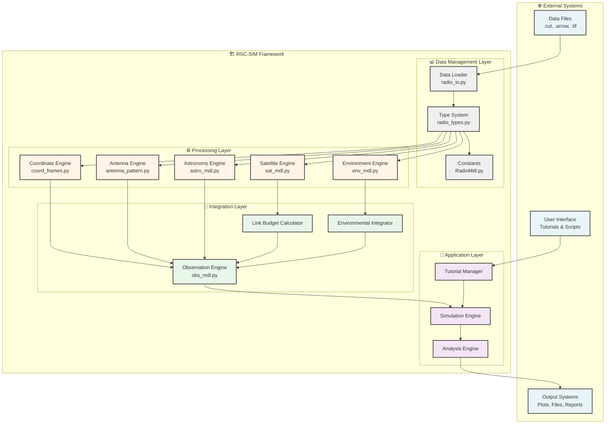
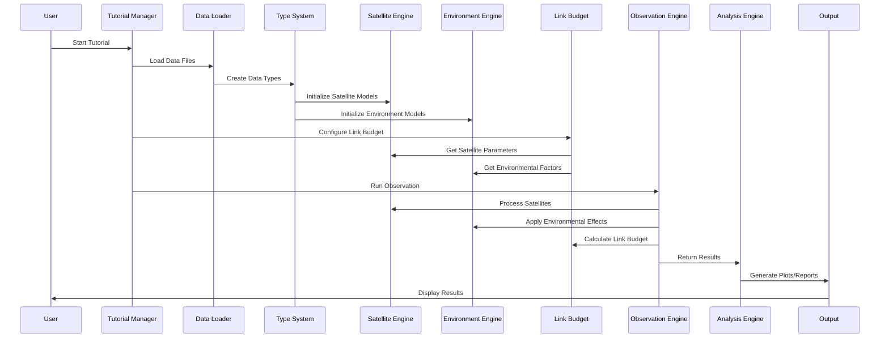
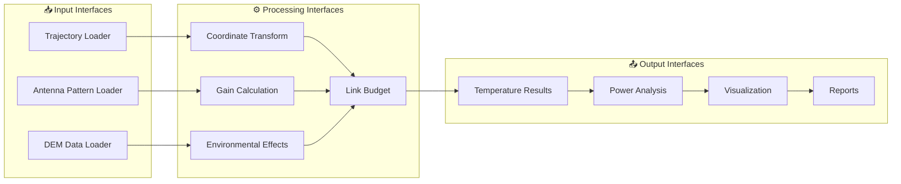
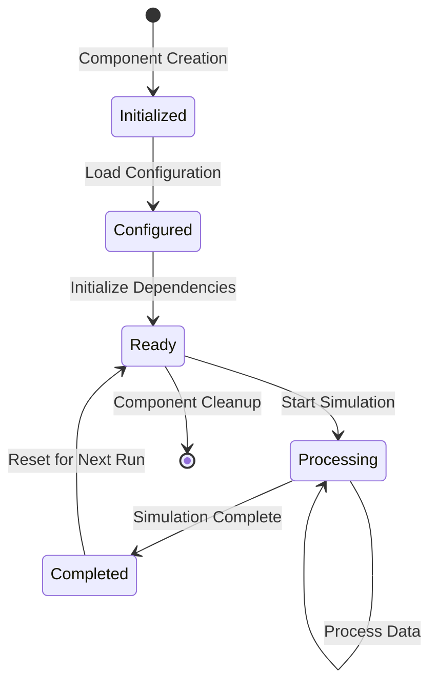
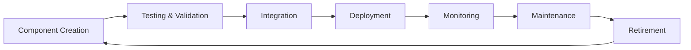

# RSC-SIM Component Framework Diagrams

This document contains all the diagrams from the RSC-SIM Component Framework documentation.

---

## 🧩 Component Overview

---

## 🔄 Component Interaction Flow

---

## 🔌 Component Interfaces

### Data Flow Interfaces

---

## 🔧 Component Configuration

### Component Lifecycle

---

## 🔄 Component Evolution

### Component Lifecycle Management

---

**Last Updated:** 2025  
**Framework Version:** 1.2.0  
**Component Count:** 8 Core + 7 Tutorial + 5 Application
